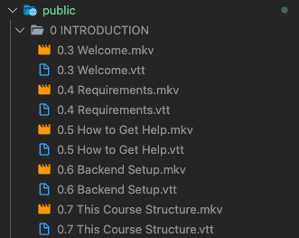

# web-video-viewer

비디오 + vtt(HTML용 자막 파일)을 재생하기 위한 프로젝트 입니다.

## Start

우버이츠 강의 기준 세팅법.

public/ 아래에 우버이츠 강의 파일을 디렉터리째로 저장합니다.



이후

```
$ yarn install
$ yarn dev
```

localhost:3000(기본 주소) 로 접속하면 public/ 아래의 디렉터리들의 이름이 표시되며, 이름을 클릭 시 해당 디렉터리 아래의 모든 영상을 재생하는 플레이어가 나타납니다.

플레이어 아래쪽의 "자동으로 다음 영상 재생" 체크박스를 활성화 하면, 현재 영상이 끝나면 자동으로 다음 영상을 불러와 재생합니다.

플레이어 하단의 "이전", "다음" 버튼으로 영상을 이동 할 수 있고
"홈" 버튼으로 맨 처음 페이지로 돌아갈 수 있습니다.

> 기본으로 세팅된 비디오 확장자는 .mkv 입니다
> 환경 변수의 VIDEO_EXTENSION을 변경하여 다른 확장자를 사용할 수 있습니다.
